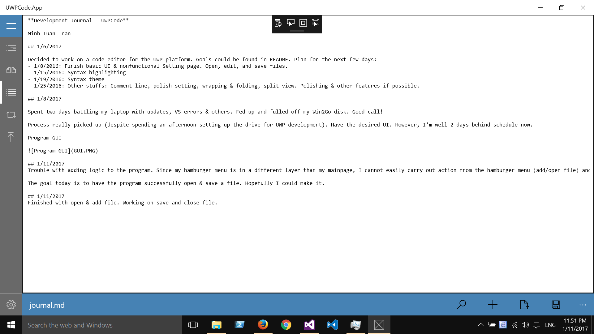

**Development Journal - UWPCode**

Minh Tuan Tran

## 1/6/2017

Decided to work on a code editor for the UWP platform. Goals could be found in README. Plan for the next few days:
- 1/8/2016: Finish basic UI & nonfunctional Setting page. Open, edit, and save files.
- 1/15/2016: Syntax highlighting
- 1/19/2016: Syntax theme
- 1/25/2016: Other stuffs: Comment line, polish setting, wrapping & folding, split view. Polishing & other features if possible.

## 1/8/2017

Spent two days battling my laptop with updates, VS errors & others. Fed up and fulled off my Win2Go disk. Good call!

Process really picked up (despite spending an afternoon setting up the drive for UWP development). Have the desired UI. However, I'm well 2 days behind schedule now.

Program GUI

## 1/11/2017
Trouble with adding logic to the program. Since my hamburger menu is in a different layer than my mainpage, I cannot easily carry out action from the hamburger menu (add/open file) and have it change the mainpage (editor, etc). One option is to reorganize my hamburger menu & command bar.

The goal today is to have the program successfully open & save a file. Hopefully I could make it.

## 1/11/2017
Finished with open & add file. Working on save and close file.

## 1/13/2017
Happy birthday to me! Got caught in birthday celebration & GRE stuffs for the last two days (ok I got a bit lazy). Anw, the goal now is to move to syntax highlighting part by 1/16, which means that I need to finish save & close files by tomorrow and search/replace by Sunday.

Search and replace seems to be the difficult one. To highlight result I will need a RichEditBox instead of a TextBox, which is awkward to use (no RichEditBox.Text....). It also means I will need to change a bit of my code. We'll see how that go.

## 1/14/2017
Finished with save files. Close file is possible, but I haven't created a GUI for the task

## 1/15/2017
Troubles with highlighting search result although searching works (not that it is difficult). Need to solve the problem before moving to syntax highlighting: if I cannot conditionally change the text format, then I can't change do any syntax highlight.

## 1/17/2017
Able to correctly highlight search result in editor. Turns out it was a weird bug in UWP that automatically hide `SelectionHighlightColor` to show when unfocused. New problem: editor change color theme when in focus. Looking to the solution. I'll start looking at syntax highlighting soon.

## 1/18/2017
Things to do: Fix the flyout appearance (it is too narrow and the searchbox has no room to breathe), fix the focus problem with the editor, and change the data structure for efficiency (we want the text to be an array of string for faster execution).

Now that I only have a week left, I need to make a choice: should I implement TextMate grammar, or should I implement syntax highlighting on my own? The first option is longer to get things done but more flexible in the future; the second is easier for one language, but not sustainable in the long haul.