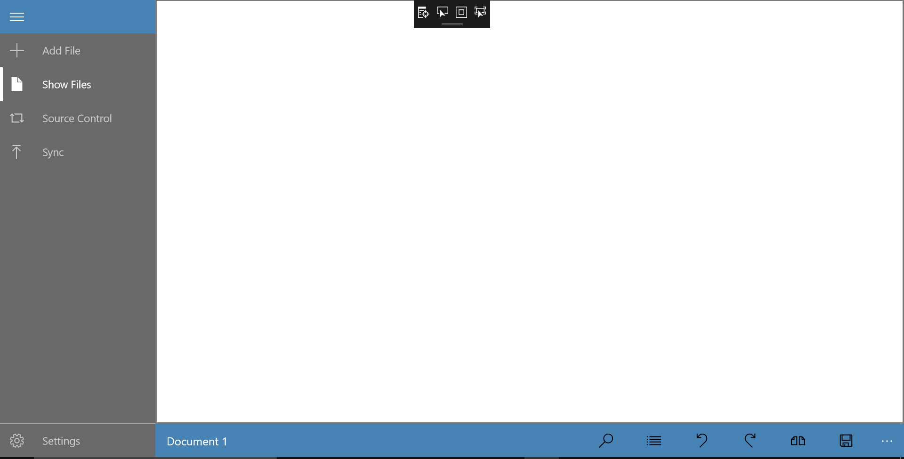

**Development Journal - UWPCode**

Minh Tuan Tran

## 1/6/2017

Decided to work on a code editor for the UWP platform. Goals could be found in README. Plan for the next few days:
- 1/8/2016: Finish basic UI & nonfunctional Setting page. Open, edit, and save files.
- 1/15/2016: Syntax highlighting
- 1/19/2016: Syntax theme
- 1/25/2016: Other stuffs: Comment line, polish setting, wrapping & folding, split view. Polishing & other features if possible.

## 1/8/2017

Spent two days battling my laptop with updates, VS errors & others. Fed up and fulled off my Win2Go disk. Good call!

Process really picked up (despite spending an afternoon setting up the drive for UWP development). Have the desired UI. However, I'm well 2 days behind schedule now.

Program GUI

## 1/11/2017
Trouble with adding logic to the program. Since my hamburger menu is in a different layer than my mainpage, I cannot easily carry out action from the hamburger menu (add/open file) and have it change the mainpage (editor, etc). One option is to reorganize my hamburger menu & command bar.

The goal today is to have the program successfully open & save a file. Hopefully I could make it.